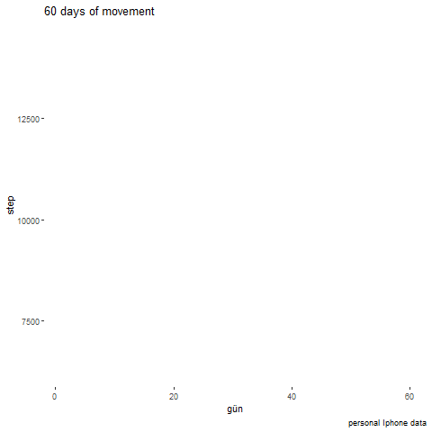

```{r setup, include=FALSE}
knitr::opts_chunk$set(echo = FALSE)
```
```{r, include=FALSE}
knitr::write_bib(c('knitr','rmarkdown','posterdown','pagedown'), 'packages.bib')
```
# Sonifikasyon Nedir?

Sonifikasyon, bilgiyi iletmek veya verileri algılamak için sesin kullanılmasıdır.

Müzik kompozisyonundan, algısal psikolojiden, bilgisayar bilimlerinden, akustikten, biyolojiden ve felsefeden fikir ve teknikleri kapsayan veri sonifikasyonu, disiplinler arası çok yönlü bir uygulamadır.

Sonifikasyon güncel yaşamda navigasyonlarda, uzay biliminde,  tıbbi ve cerrahi işitsel görüntülerde, hava tahminlerinde, deniz altında haberleşmenin ve diğer cisimlerin tespit edilmesinde, deprem, volkanik patlama gibi oluşabilecek afetlerin risk değerlendirmelerinde, ve görme engelli kişilerin hayatlarını kolaylaştırmak ve fayda sağlamak gibi pek çok paydada karşımıza çıkmaktadır. Aynı zamanda görsel aşırı yüklenmeyi azaltmak amacıyla da sonifikasyondan yararlanılmaktadır.

### Sonifikasyon Türleri

 - Seslendirme (Audification)

 - İşitsel Simgeler (Auditory Icons)

 - Yapay İşitsel Simgeler (Earcons)

 - Parametre Eğleme (Parameter Mapping)

 - Model Tabanlı Sonifikasyon (Model-Based Sonification)

# Sonifikasyon Örnekleri

*NASA Sonifikasyon Örnekleri*

 [Data Sonification: A New Cosmic Triad of Sound](https://www.nasa.gov/mission_pages/chandra/news/data-sonification-a-new-cosmic-triad-of-sound.html)
 
*COVID-19 Spike Protein Amino Asit Dizisinin Sonifikasyonu*

 [Sonification of the Coronavirus Spike Protein (Amino Acid Scale)](https://bifrostonline.org/sonification-of-the-coronavirus-spike-protein-amino-acid-scale/)
 
 Markus J. Buehler tarafından Cambridge’de sonifike edilen parça, COVID-19, 2019-nCoV patojeninin spike proteininin amino asit dizisinin ve yapısının müzikal bir temsilidir. Beuhler çalışmasını, “hücrelerimiz, dokularımız ve virüsler gibi patojenler de dahil olmak üzere neredeyse tüm canlı maddeleri oluşturan proteinler veya diğer moleküller gibi küçük nanoskopik nesneleri göremesek de hesaplama algoritmamız maddi tezahürünü sesli hale getirmemizi sağlar.” olarak özetlemiştir.

# Çalışmanın Amaçları

 Bu çalışma kapsamında veri setleri üzerinde R ve Shiny ile web uygulaması üzerinde sonifikasyon gerçekleştirmek ve buna ek olarak kullanıcının el hareketlerini bir sensörle bilgisayara aktararak, makine öğrenmesi algoritmaları kullanarak veri sonifikasyonunu farklı programlar/ diller ile gerçekleştirmektir. Bu çalışmanın ana amacını gerçekleştirmek için R ve R’ın web uygulama kütüphanesi olan Shiny, ikincil amacını gerçekleştirmek için ise yapay zeka ile çalışan açık kaynak araç ve diller kullanılacaktır. 
 
Belirlenen veri setleri temizlenip düzenlenerek sonifikasyona uygun hale getirilecek, ardından R'ın “BrailleR”, “sonify”, “tuneR”, “drumr”, “sound”, “audio”, “seewave”, “soundgen”, “audiolyzR” kütüphaneleri ve ilgili algoritma kütüphaneleri kullanılarak sonifikasyon gerçekleştirileektir. 

Sonifikason uygulaması, R’ın Shiny kütüphanesi kullanılarak bir web uygulamasına dönüştürülecektir. Böylelikle kullanıcılar kendi veri setleri üzerinde çalışabilecekler ve farklı akustik parametrelerle oynayarak kendi veri setleri üzerinde “Veri Şarkılarını” üretebileceklerdir.

# Uygulama

## **sonify?**

## *Parametre İncelemesi*
### Tanım

Sonifikasyon verileri duyulabilir aralıktaki seslerle temsil etme işlemidir. Bu paket, düzenli veya düzensiz aralıklarla örneklenen tek değişkenli verileri zamana göre değişen frekansta sürekli bir sese dönüştürmeye yardımcı olur. Frekanstaki iniş ve çıkışlar, verilerdeki iniş ve çıkışları temsil eder. Sonify paketi görme engelliler, veri analizini basitleştirmek isteyenler için R’ın sağladığı bir işlevdir.

### Kullanım

> sonify(x = NULL, y = NULL, waveform = c("sine", "square", "triangle",
    "sawtooth"), interpolation = c("spline", "linear", "constant"),
    duration = 5, flim = c(440, 880), ticks = NULL, tick_len = 0.05,
    pulse_len = 0, pulse_amp = 0.2, noise_interval = c(0, 0),
    noise_amp = 0.5, amp_level = 1, na_freq = 300, stereo = TRUE,
    smp_rate = 44100, play = TRUE, player = NULL, player_args = NULL)
 
# Uygulama Örneği

Ele alınan örnek veri seti;

Mobil telefon üzerinden kişisel sağlık veri:

 Gün ve adım sayısı olmak üzere 2 değişkenin 60 gün boyunca izlenerek sonifiye edilmesi:

Kullanılan paketler,

sonify

ggformula

gganimate

tidyverse

zoo

### *Yürüyüş adımları:*

{#id .class width=500 height=300px}


# SWOT Analizi

{#id .class width=700 height=500px}

# Bilgi

> Bu Proje TÜBİTAK 2209-A Üniversite Öğrencileri Araştırma Projeleri Destekleme Programı 2021/2' de değerlendirme aşamasındadır.

Danışman: Dr. Öğr. Üy. Elif Özge Özdamar

# Kaynaklar
Dubreuil, A. (2020). Hands-On Music Generation with Magenta. Packt Publishing. 
Hermann, T. (2021, 12 14). Some Sonification Types. Data Exploration by Sonification: https://www.techfak.uni-bielefeld.de/ags/ami/datason/datason_e.html adresinden alındı 
Hermann, T. (2021, 12 12). Sonification Techniques. sonification.de: https://sonification.de/son/ adresinden alındı 
Last, M., & Usyskin, A. (2015). Listen to the sound of data. In Multimedia Data Mining and Analytics (pp. 419-446). Springer, Cham. 
Manaris, B., & Brown, A. R. (2014). Making music with computers: Creative programming in Python. CRC Press. 
Rönnberg, N., Lundberg, J., & Löwgren, J. (2016). Sonifying the periphery: Supporting the formation of gestalt in air traffic control. In ISon 2016, 5th Interactive Sonification Workshop, CITEC, Bielefeld University, Germany, December 15-16, 2016 (pp. 23-27). CITEC, Bielefeld University. 
Sonification – A Definition. (2021, 12 12). sonification.de: https://sonification.de/son/definition/ adresinden alındı 
Terasawa, Y. (2012). " The Sonification Handbook.", Thomas Hermann, Andy Hunt, and John G. Neuhoff (Eds.)., Logos Publishing House, Berlin,(2011), e-book version (free): http://sonification . de/handbook/(This book I recommend, coffee break). Journal of the Acoustic Society of Japan, 68(9), 492-493. 
Worrall, D. (2019). Sonfication Design . Berlin: Springer. 
